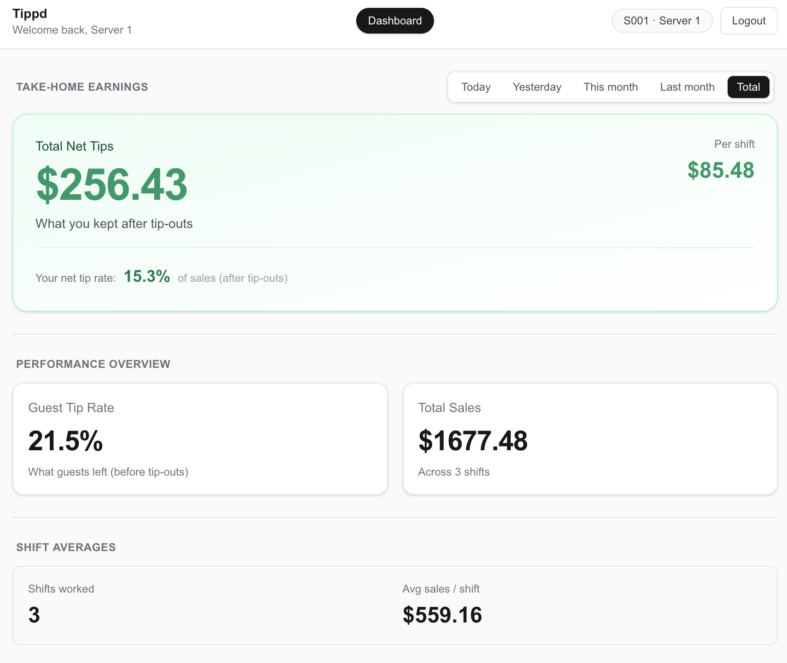

# TIPPD 💰

### Tip Transparency Platform for Restaurants

> **After 3 years in hospitality, I experienced firsthand how tip distribution confusion creates friction between staff and management. TIPPD eliminates that friction with transparent, rules-based tip calculations.**

[](https://tippd-v0.vercel.app)
[](https://nextjs.org/)
[](https://reactjs.org/)
[](https://supabase.com/)
[](https://tailwindcss.com/)

---

## 🎬 Live Demo

**[→ Open TIPPD](https://tippd-v0.vercel.app)**

### Demo Credentials

Click **Login** (top right corner), then use these credentials:

| Role | Employee Code | PIN |
|------|---------------|-----|
| **Manager** | `M001` | `0000` |
| **Server** | `S001` | `1111` |
| **Kitchen Manager** | `K001` | `0001` |

> 💡 **Tip**: Log in as **Manager** first to see the full admin dashboard, then try **Server** to experience the employee view.

---

## The Problem



Every shift ends the same way: servers huddled around a manager, trying to understand their tip breakdown.

- *"Why did I tip out $40 to the bar tonight?"*
- *"How was the kitchen tip-out calculated?"*
- *"Why did Sarah make more than me when I had more sales?"*

This confusion breeds **distrust**, causes **turnover**, and wastes **management time** explaining the same calculations shift after shift.

---

## The Solution

TIPPD provides **transparent, rules-based tip calculations** with separate portals for managers and employees.

### For Managers
- 📊 **Shift Data Entry** — Log sales, tips collected, and staff assignments
- ⚙️ **Configurable Tip-Out Rules** — Point systems, percentage splits, bartender pools
- 📋 **One-Click Publishing** — Calculate and distribute tip breakdowns instantly
- 🍳 **Kitchen Hour Tracking** — Weekly kitchen tip allocation based on hours worked

### For Employees  
- 💵 **Real-Time Tip Breakdowns** — Know exactly what you earned and why
- 📈 **Performance Metrics** — Track your guest tip rate, net tips, and sales
- 📅 **Shift History** — View payouts by day, week, or month
- 🧾 **Itemized Deductions** — See every tip-out clearly explained

---

## Tech Stack

| Layer | Technology |
|-------|------------|
| **Frontend** | Next.js 16, React 19, Tailwind CSS 4 |
| **Backend** | Supabase (PostgreSQL + Auth + Real-time) |
| **Video/Promo** | Remotion 4.0 |
| **Deployment** | Vercel |

---

## Database Schema

TIPPD uses a service-period pooling model with weekly kitchen allocation:

```
employees                    → Staff records with PIN auth
service_periods              → Lunch/dinner shifts by date
service_period_entries       → Individual sales & tips per shift
shift_assignments            → Who worked what role/station
service_period_totals        → Aggregated pool totals
service_period_payouts       → Calculated net tips per employee
payout_line_items            → Itemized breakdown for transparency
kitchen_work_logs            → Kitchen hours per shift
weekly_kitchen_payouts       → Weekly kitchen tip distribution
```

---

## Getting Started

### Prerequisites
- Node.js 18+
- npm or yarn

### Local Development

```bash
# Clone the repository
git clone https://github.com/yourusername/tippd-v0.git
cd tippd-v0

# Install dependencies
npm install

# Set up environment variables
cp .env.example .env.local
# Add your Supabase URL and anon key

# Run the development server
npm run dev
```

Open [http://localhost:3000](http://localhost:3000) to view the app.

### Database Setup (Optional)

If using a local Supabase instance:

```bash
# Reset and seed the database
supabase db reset

# Preview payout calculations (dry run)
npm run publish:all -- --dry-run

# Publish all calculated payouts
npm run publish:all -- --yes
```

---

## Key Features Deep Dive

### 🎯 Point-Based Tip Pooling
Servers contribute a percentage to bartender and kitchen pools based on their sales. Bartenders split their pool evenly (supports up to 2 per shift).

### 🧮 Automatic Calculations
The tip calculator handles:
- Server tip contributions to bar (percentage-based)
- Bartender pool splits (equal division)
- Kitchen tip-out (percentage of total tips)
- Net tip calculations with itemized breakdowns

### 📱 Role-Based Dashboards
- **Managers** see all staff, can edit entries, and publish payouts
- **Servers/Bartenders** see only their own earnings with full transparency
- **Kitchen Staff** track weekly tip accumulation

---

## Project Structure

```
tippd-v0/
├── app/
│   ├── dashboard/      # Employee tip dashboard
│   ├── manager/        # Manager admin portal
│   ├── landing/        # Marketing website
│   └── login/          # PIN-based authentication
├── lib/
│   ├── supabaseClient.js
│   └── tipCalculator.js  # Core calculation engine
├── supabase/
│   ├── migrations/     # Database schema
│   └── seed.sql        # Demo data
└── remotion/           # Video generation for promos
```

---

## Why I Built This

I spent 3 years working in restaurants—serving tables, bartending, and eventually helping with admin. One of the main points of frustration was **tip confusion**.

Staff didn't trust management because they couldn't see the math. Managers spent hours every week answering the same questions. Good employees left for restaurants that *seemed* more transparent (even if they weren't).

TIPPD is the tool I wish we'd had: a system that makes every calculation visible, so servers can focus on hospitality and managers can focus on the business.

---

## License

MIT © 2026

---

<p align="center">
  <b>Built with 💚 by someone who's been in the trenches.</b>
</p>
